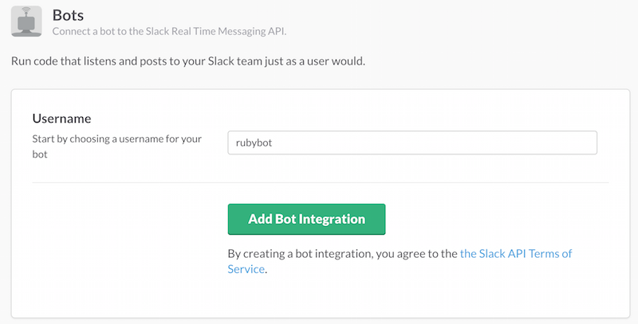

# WishBot

A Slack bot that helps to appreciate team members. It also helps us to track the appreciation history and leaderboard, giverboard, stats when ever needed.

## Installation

Clone this repositary.

```
git clone https://github.com/rameshrvr/KudosBot_2.0.git
```

Run `bundle install`.

## Usage

### Create a New Bot Integration

This is something done in Slack, under [integrations](https://my.slack.com/services). Create a [new bot](https://my.slack.com/services/new/bot), and note its API token.




### Settings

If you are using a linux machine

```
export SLACK_API_TOKEN={your slack app api token}
```

If you are using a windows machine

```
SET SLACK_API_TOKEN={your slack app api token}
```

Create a new database using the below comment (You can edit your database name, table name, column values in create_new_database.rb)

```
ruby Database/create_new_database.rb
```

### Start Application

Start the server using the below comment

```
ruby Server/start_server.rb
```

### Examples

#### To see all supported commands (help)


#### Giving appreciations to team members


#### View Leaderboard


#### View Giverboard


#### View your stats


